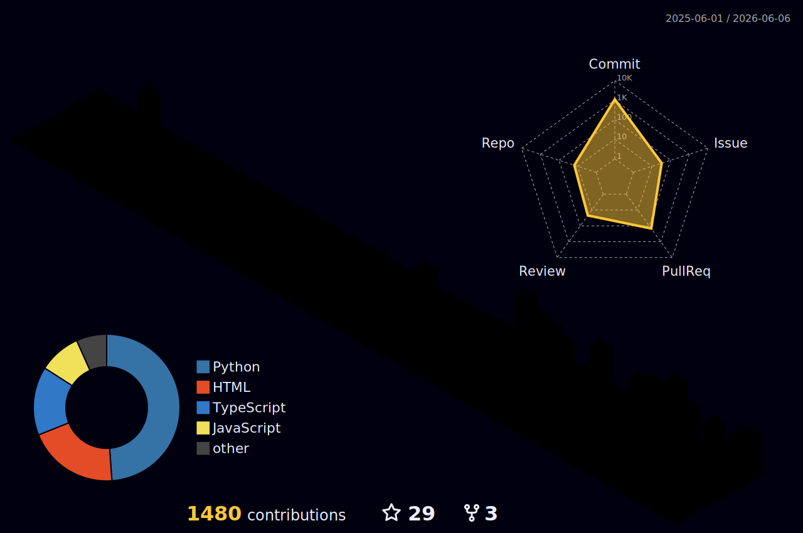

<!--
  GitHub Profile README for lifeodyssey
  Focus: Backend Engineering · Cloud Infrastructure · Agentic Engineering
-->

  

  
  

## 👋 About

I'm a backend-focused software engineer at **Thoughtworks**. I build reliable backend systems, cloud delivery workflows, and practical AI engineering tools that can survive real production pressure.

My current focus is **agentic engineering**: coding-agent harnesses, context-aware developer tooling, multi-agent workflow design, token budgeting, and the infrastructure needed to make AI useful in everyday software delivery.

I care about boring reliability, clear boundaries, observable behavior, and tools that help teams move faster without making the codebase harder to change.

---

## 🔎 Current Focus

| Area | What I build | Evidence |
|---|---|---|
| Agent workflow harnesses | Patterns, skills, plugins, orchestration loops, and evaluation scaffolds for coding agents. | [Agent Patterns Lab](https://github.com/lifeodyssey/agent-patterns-lab), [Alloy](https://github.com/lifeodyssey/alloy), [Reins](https://github.com/lifeodyssey/reins) |
| Cloud-hosted developer tools | Small products that combine backend boundaries, deployment automation, moderation, and operational constraints. | [ShareHTML](https://github.com/lifeodyssey/share-html), Cloudflare Workers, Supabase, GitHub Actions |
| Practical AI products | Agentic applications where retrieval, planning, UX, and deployment have to work together. | [Seichijunrei Agent](https://github.com/lifeodyssey/Seichijunrei-agent) |
| Writing and workflow design | Notes on context engineering, cost control, agent skills, and multilingual publishing. | [zhenjia.dev](https://zhenjia.dev/) |

---

## 🚀 Flagship Work

| Project | Why it matters | Core proof |
|---|---|---|
| [Seichijunrei Agent](https://github.com/lifeodyssey/Seichijunrei-agent) | A real agentic product for anime pilgrimage search and route planning, where multilingual queries, geo retrieval, route constraints, and user experience have to meet in one system. | Agent workflow, geo retrieval, route planning, Supabase/PostGIS, Cloudflare deployment |
| [ShareHTML](https://github.com/lifeodyssey/share-html) | A cloud-hosted tool for uploading a single HTML file and sharing it through a sandboxed, moderated preview URL. | Cloudflare Workers, Supabase, auth flow, expiry rules, scanner/moderation workflow |
| [Agent Patterns Lab](https://github.com/lifeodyssey/agent-patterns-lab) | An offline-first reference implementation for agent design patterns, from function calling and structured output to ReAct, workflow loops, multi-agent systems, and eval harnesses. | Runnable examples, MockLLM, tests, docs, Cloudflare Pages |
| [Retypeset Odyssey](https://github.com/lifeodyssey/retypeset-odyssey) | A trilingual Astro theme powering [zhenjia.dev](https://zhenjia.dev/), built around MDX, i18n, search, redirects, and translation workflow support. | Astro theme, multilingual publishing, Pagefind, Cloudflare Pages |

---

## 🧪 Labs and Side Projects

| Project | Direction |
|---|---|
| [Alloy](https://github.com/lifeodyssey/alloy) | Runtime-neutral distribution layer for AI coding agent workflows, materializing curated skills, agents, commands, plugins, MCPs, and workflow state into OpenCode projects. |
| [Reins](https://github.com/lifeodyssey/reins) | Harness engineering framework and multi-agent sprint orchestrator plugin for Claude Code. |
| [Craftsmanship Skills](https://github.com/lifeodyssey/craftsmanship-skills) | Agent skills distilled from Clean Code and Refactoring, bringing software craftsmanship into AI coding agents. |
| [Animal Island UI](https://github.com/lifeodyssey/animal-island-ui) | Animal Crossing-inspired React component library built with Tailwind CSS, Radix UI, Storybook, tests, and publishing workflow. |

---

## ✍️ Selected Writing

I write mainly in Chinese, with English and Japanese versions for selected posts.

- [How to Optimize Coding Agent Costs](https://zhenjia.dev/en/posts/coding-agent-cost-optimization)  
  Research notes from prompt cache to context engineering, token budgeting, model tiering, and cost observability.  
  [中文](https://zhenjia.dev/posts/coding-agent-cost-optimization) · [日本語](https://zhenjia.dev/ja/posts/coding-agent-cost-optimization)

- [Understanding Claude Code's Skills and Plugins](https://zhenjia.dev/en/posts/claude-code-skills-plugins-guide)  
  A developer-oriented explanation of skills, plugins, tools, and agent workflow design.  
  [中文](https://zhenjia.dev/posts/claude-code-skills-plugins-guide) · [日本語](https://zhenjia.dev/ja/posts/claude-code-skills-plugins-guide)

- [I Built a Translation Agent for My Blog Without Writing Code](https://zhenjia.dev/en/posts/blog-translation-agent-without-code)  
  A practical experiment in using an agent to automate a real multilingual publishing workflow.  
  [中文](https://zhenjia.dev/posts/blog-translation-agent-without-code) · [日本語](https://zhenjia.dev/ja/posts/blog-translation-agent-without-code)

- [My Core Agent Coding Workflow](https://zhenjia.dev/en/posts/my-core-agentic-coding-workflow-on-2025-12-8)  
  Notes on using coding agents in personal projects and evolving an agent-first development workflow.  
  [中文](https://zhenjia.dev/posts/my-core-agentic-coding-workflow-on-2025-12-8) · [日本語](https://zhenjia.dev/ja/posts/my-core-agentic-coding-workflow-on-2025-12-8)

---

## 🧰 Working Stack

  

---

## 🌱 Contribution Flow

  <picture>
    <source
      media="(prefers-color-scheme: light)"
      srcset="./profile-3d-contrib/profile-season.svg"
    />
    
  </picture>

  
Contribution snake

  

    <picture>
      <source
        media="(prefers-color-scheme: dark)"
        srcset="https://raw.githubusercontent.com/lifeodyssey/lifeodyssey/output/github-snake-dark.svg"
      />
      <source
        media="(prefers-color-scheme: light)"
        srcset="https://raw.githubusercontent.com/lifeodyssey/lifeodyssey/output/github-snake.svg"
      />
      
    </picture>
  

---

## Quote

> Build useful things. Make them reliable. Then make them easier for the next engineer to understand.
